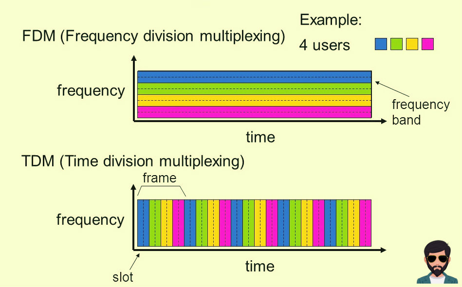

# Week One: The Internet

## Learning Goals

### I can explain the role that the network core plays vs the network edge.
The network edge describes all of the end users and the edge router that connects them to the network core. The purpose of this first link in the internet is to connect users and applications from a subnet to the greater internet. This is primarily achieved by using a local base station or link layer switch to connect a variety of physically close devices to an edge router.

All of the devices and connections between them in the edge are hyper local and usually consolidated to one household or enterprise. These devices are ultimately connected to the edge router which is the access point that links the network edge to the network core. All of the local devices connected in a subnet are ultimately linked to the core via an edge router.

The network core consists of all of the data moving between subnets past the edge router. Edge routers ultimately communicate with local ISPs which move data to higher tiers of ISPs. Unlike the edge, the core is responsible for moving data over much larger distances at greater speeds.

### I can compare different physical technologies used in access networks, including dial-up, DSL, cable, fiber, and wireless.

**DSL**
- Internet provided by telephone service provider or telco using telephone infrastructure.
- Endusers submit data via a DSL modem for their telephone and data traffic to be combined.
- Data and telephone traffic is separated by a DSLAM at a telco Central Office to be sent over the internet or telephone network.
- The current version of DSL has an upstream/downstream of 1 Gbps. Earlier versions had slower, asymmetric speeds.
- Two downsides are that the actual upstream/downstream speeds of the data can be throttled by the telco or impacted by twisted wire gauge/distance from enduser to CO.

**Cable**
- Internet provided by cable television company using cable infrastructure.
- Endusers submit data via the hybrid fiber coax. End users use a cable modem to transfer data to coax. Neighborhood connected by coax cables send data to fiber nodes which in turn send data via fiber to the cable head end.
- The cable head end connects to the internet via a CMTS which is similar to a DSLAM for cable.
- One downside of cable is that it is a shared broadcast medium. All packets sent upstream/downstream on every link to every home. Multiple end users in one neighborhood thus leads to slower rates.

**Fiber**
- Takes advantage of FTTH, Fiber To The Home, to provide optical fiber directly from the CO to homes rather than converting Coax to fiber.
- Potentially gigabits per second speeds
- Fiber is provided to homes via direct fiber, Active Optical Networks (AONs) and Passive Optical Networks (PONs). The latter two use splitters to split one optical connection from the neighborhood for neighborhoods.
    - Direct fiber runs an individual fiber cable to each home from the CO
    - Active Optical Networks are essentially switched ethernet
    - Passive Optical Networks have a Optical Line Terminator at the CO and each home. Optical signals are split and fed to OLTs at each home.

**Wireless**
- 5G Fixed Wireless requires no cabling from CO to homes. Internet is cent via beam-forming technology from a provider's base station to a modem in the home.
- Cabling is often failure prone and costly so avoiding it is good.

### I can use queuing, transmission, and propagation delays to calculate total packet delay, I can describe the underlying causes for these delays, and I can propose ways to improve packet delay on a network.

#### Queuing
**Cause of Delay:** Occurs when multiple full packets arrive at the Router and are ready to be sent to the next link but the link is busy. When this happens the packets must wait in the output buffer. If too many packets are waiting in the buffer for the output link and the buffer is full then packet loss occurs and one of the newly arriving packets or one of the waiting packets is dropped. 
**Length of the Delay:** Dependent on the number of packets queued in the router. If their are no packets queued the queuing delay is zero. Typically the average number of packets arriving per second is used however to calculate queuing delay.
$$ \text{L = Length of packets in Bits} \\ \text{a = Avg rate of packet arrival} \\ \text{R = Transmission speed in Bits/Second} \\ \text{Traffic Intensity} = \frac{La}{R} \text{ seconds} $$ 
**How to Improve:** Design a network system so that the average rate at which bits arrive never exceeds the rate at which the bits are transmitted from the queue. If the traffic intensity exceeds 1 this occurs.
#### Transmission
**Cause of Delay:** After a packet has reached the front of the queue it must be transmitted from the router where it is fully assembled back onto a wire to its next destination. The time it takes to transfer the packet from the router onto the wire is transmission delay 
**Length of the Delay:** 
$$ \text{L = Length of packet in Bits} \\ \text{R = Transmission speed in Bits/Second} \\ \text{Time to Transmit} = \frac{L}{R} \text{ seconds} $$ 
**How to Improve:** Increase the transmission speed of the link by upgrading the router's ability to process packets and put them on the link. Or create more links from the router so there is less chance of a busy link.
#### Propagation
**Cause of Delay:** Once a packet is on the link to the next router or enduser it takes time to travel to the next router or enduser. While a bit is on a link it travels at near light speed.The time it spends traveling at this speed along a link is the propagation delay and is dependant on the speed of the physical medium of the link. 
**Length of the Delay:**
$$ \text{D = Physical distance the link covers} \\ \text{S = propagation speed of the link in Distance/Second} \\ \text{Time to Transmit} = \frac{D}{S} \text{ seconds} $$ 
**How to Improve:** This delay can be improved by upgrading the medium of the link to a medium with a faster propagation speed or by decreasing the distance between routers.

#### Calculating Total Delay
Total packet delay is equal to the sum of all of the delays mentioned above. An example of how all these delays might play out might look like this:

Router A --Link  from A to B---> Router B
| Packet 1                | Packet 2                |
|-------------------------|-------------------------|
| Transmission delay      | Queueing delay          |
| Propagation delay       | Transmission delay      |
| Arrive at B             | Propagation Delay       |
| Queued at B             | Arrive at B             |

 Diagram in narrative form

Router A receives two packets at the same time and is linked to Router B. The first packet will experience no queuing delay and immediately starts experiencing transmission delay as it is processed Router A to be sent on the link to Router B. The second packet waits and incurs queuing delay during this time. When the first packet is finished transmitting it begins propagation delay on the link to the next router. Immediately the second packet begins transmitting. The first packet arrives at B and the second packet begins propagating until it too arrives at B. 

 

For packet one The total delay is:
$$ \frac{L}{R}+\frac{D}{S} = \text{Total Delay 1}$$

For packet two The total delay is:
$$ \frac{La}{R} + \frac{L}{R}+\frac{D}{S} = \text{Total Delay 2}$$

### I can describe the differences between packet-switched networks and circuit-switched networks.
| Packet-Switched    | Circuit-Switched |
|--------------------|------------------|
| Packets are transmitted over each communication link at a rate equal to the full transmission rate | Connections transmit at a guaranteed constant rate which is a fraction of the link's transmission capacity|
| Resources needed along a path are not reserved resulting in queuing delays | Resources are reserved along a path and resources do not need to wait for an open path  |
|Source end systems send packages that find their way through the internet using an IP address|A connection must be established between sender and receiver before connecting using a dedicated end-to-end connection|
|Simpler more efficient and cheaper to implement with better transmission capacity |Steady predictable connection is better for real-time services|
|Essentially the same performance for an averaged number of users but allows three times the number of users|Dedicated links provide constant speed but waste link space when users are not actively using the link|

### I can describe how to create multiple channels in a single medium using FDM and TDM.
#### FDM - Frequency Division Multiplexing
- Dedicates a frequency band to each connection for the duration of the connection. 

#### TDM - Time Division Multiplexing
- Time is divided into frames of fixed duration and each frame has a fixed number of slots. During a connections time slot they have access to all bandwith.

Graph of TDM vs FDM

Source: https://oyehero.com/india-bio/gyan/tdm-and-fdm-difference-in-hindi/

### I can describe the hierarchy of ISPs and how ISPs at different or similar levels interact.
In the hierarchy of ISPs internet providers operate routers to rout traffic between smaller subnets so that endusers can communicate across the globe. At the lowest level Access ISPs serve a community by forwarding internet traffic to Regional ISPs. Regional ISPs serve a region like the east or west coast. Tier-1 ISPs are national or global ISPs that forward the traffic of the providers below them to the world.

                             Tier 1 ISP
                          _____|_____ \_____
                         /           \      \__________
                        /             \                \__
             Regional ISP --Peering-- Regional ISP____    \__
             /     |  \______                |        \      \_____
            /      |         \<--Multihome-> |          \          \
     Access ISP  Access ISP   \_____         |    Access ISP     Access ISP
                                    Access ISP
Although most providers purchase internet access from a single provider above them. It is not uncommon for ISPs to use multihoming and peering to ensure that their customers always have access. Multihoming is when an ISP purchases intranet from two higher ISPs. Peering is when two ISPs on the same level share traffic to ensure that connection stays strong.

### I can explain how encapsulation is used to implement the layered model of the Internet.

