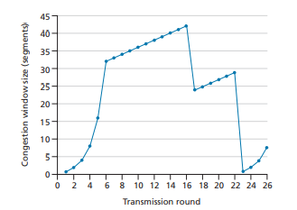

# Week Five: Transport Layer

## Review Questions

### R17: Suppose two TCP connections are present over some bottleneck link of rate R bps. Both connections have a huge file to send (in the same direction over the bottleneck link). The transmissions of the files start at the same time. What transmission rate would TCP like to give to each of the connections?

- The overall transmission rate achieved by each host at the beginning of the file transfer is 
- I am not at liberty to discuss the fairness of life or networks.

***

### R18: True or false? Consider congestion control in TCP. When the timer expires at the sender, the value of ssthresh is set to one half of its previous value

- False, the new value is one half of cwind.

***

## Problems

### P27: Host A and B are communicating over a TCP connection following RFC 5681. Host B has already received from A all bytes up through byte 96. Suppose Host A then sends two segments to Host B back-to-back. The first and the second segments contain 40 and 80 bytes of data, respectively. In the first segment, the sequence number is 97, the source port number is 302, and the destination port number is 80

*Host B sends an acknowledgment whenever it receives a segment from Host A.*  
**a.** In the second segment sent from Host A to B, what are the sequence number, source port number, and destination port number?  
```
Seq Number = 207
Source Port = 302
Destination Port = 80
```
**b.** If the first segment arrives before the second segment, in the acknowledgment of the first arriving segment, what is the acknowledgment number,
the source port number, and the destination port number?
```
ACK Number = 207
Source Port = 80
Destination Port = 302
```

**c.** If the second segment arrives before the first segment, in the acknowledgment of the first arriving segment, what is the acknowledgment number?
```
ACK Number = 127
```

**d.** Suppose the two segments sent by A arrive in order at B. The first acknowledgment arrives after the first timeout interval. What is
***

### P33: In Section 3.5.3, we discussed TCP’s estimation of RTT. Why do you think TCP avoids measuring the SampleRTT for retransmitted segments?

***

### P36: In Section 3.5.4, we saw that TCP waits until it has received three duplicate ACKs before performing a fast retransmit. Why do you think the TCP designers chose not to perform a fast retransmit after the first duplicate ACK for a segment is received?

***

### P40: Consider Figure 3.61. Assuming TCP Reno is the protocol experiencing the behavior shown above, answer the following questions. In all cases, you should provide a short discussion justifying your answer.
  
**a.** Identify the intervals of time when TCP slow start is operating.  
**b.** Identify the intervals of time when TCP congestion avoidance is operating.  
**c.** After the 16th transmission round, is segment loss detected by a triple duplicate ACK or by a timeout?  
**d.** After the 22nd transmission round, is segment loss detected by a triple duplicate ACK or by a timeout?
