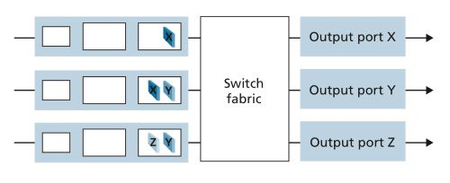
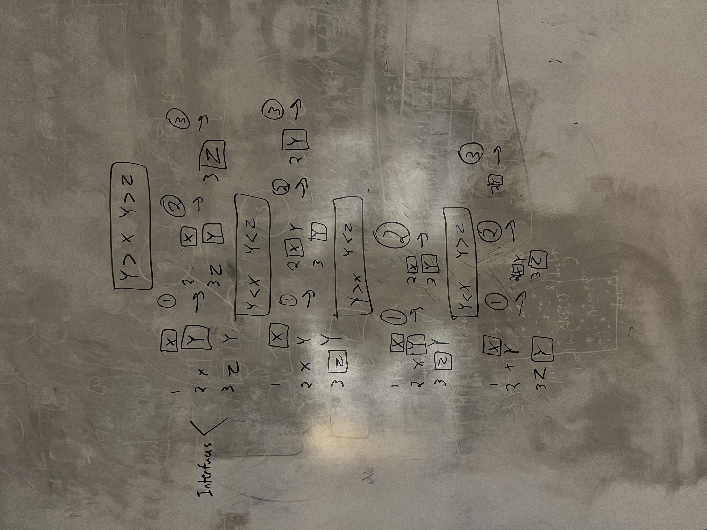
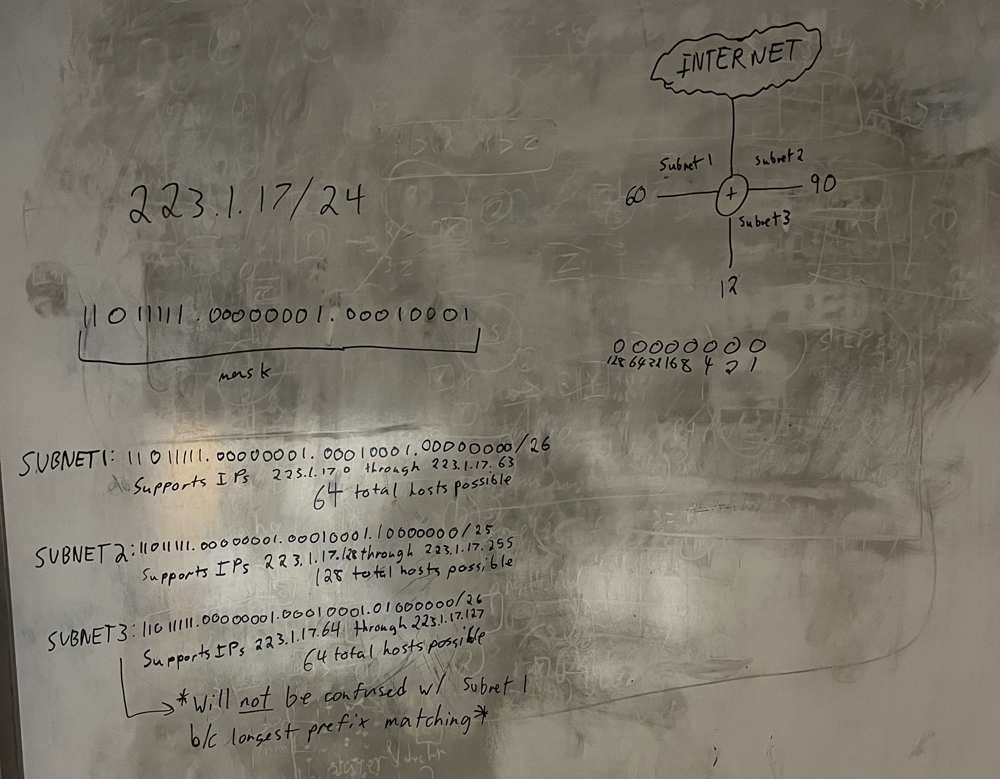

# Week Seven: The Network Layer: Data Plane

## Review Questions

### R11: Describe how packet loss can occur at input ports. Describe how packet loss at input ports can be eliminated (without using infinite buffers)

When packets come into the input ports they may have to wait to go through the routers switching fabric. This is caused by two situations, output port contention and HOL blocking. Output port contention occurs when two input ports have packets to be sent onto the same input port at the same time so one must wait while the other goes through the switching fabric. HOL blocking occurs when an output port is open for a datagram in an input port but it is in line behind another datagram in the same input port. As more packets arrive in the input port and not enough are sent, they fill up the routers input buffer. If the buffer is filled then incoming packets are dropped. We can elimnate packet loss at input ports by increasing the switch fabric speed so packets never have the chance to build up if they are switched faster than they come in

***

### R12: Describe how packet loss can occur at output ports. Can this loss be prevented by increasing the switch fabric speed?

Packet loss can also be dropped in the output if it takes too much transmission delay. This loss will not be prevented by increasing switch fabric speed because that will only make packets arrive to be transmitted quicker. To prevent buildup the transmission speed should be upgraded so packets that come from the switch fabric are sent faster than they arrive.

***

### R13: What is HOL blocking? Does it occur in input ports or output ports?

HOL blocking occurs when an output port is open for a datagram in an input port but it is in line behind another datagram in the same input port.

***

### R16: What is an essential difference between RR and WFQ packet scheduling? Is there a case (hint: consider the WFQ weights) where RR and WFQ will behave exactly the same?

WFQ is a combination of RR and prioritized queuing. In RR there is no priority so each group of packets gets equal chance to transmit. In WFQ each group gets some time unlike prioritized where if a higher priority always has packets the lower priorities will never send. If all of the weights for each group of packets are the same or if one group has no packets to send thus creating equal weights for those that do, WQF will behave the same as RR.

***

### R18: What field in the IP header can be used to ensure that a packet is forwarded through no more than N routers?

The time to live field ensures that the IP header doesn't circulate forever in something like a long-lived routing loop in the network. The field is decremented each time the packet forwards through a router. Once it reaches zero the router must drop it.

***

### R21: Do routers have IP addresses? If so, how many?

Routers do have IP addresses, they have one for each of their interfaces that corresponds to the subnet they are connected to or it matches the IP of an adjacent router connected to that interface.

***

## Problems

### P4: Consider the switch shown below. Suppose that all datagrams have the same fixed length, that the switch operates in a slotted, synchronous manner, and that in one time slot a datagram can be transferred from an input port to an output port. The switch fabric is a crossbar so that at most one datagram can be transferred to a given output port in a time slot, but different output ports can receive datagrams from different input ports in a single time slot. What is the minimal number of time slots needed to transfer the packets shown from input ports to their output ports, assuming any input queue scheduling order you want (i.e., it need not have HOL blocking)? What is the largest number of slots needed, assuming the worst-case scheduling order you can devise, assuming that a non-empty input queue is never idle?



- Mininmally two time slots would be needed if HOL blocking is ignored and input scheduling is ignored. This way you would schedule Z to send before Y so that in t1 you send X, Y, and Z. Then at t2 you would send X and Z.
- In the worse case senario the priority would be if Y was scheduled after both X and Z or if Y was schduled before X and Z or if Y was scheduled to send after X and before Z. I have drawn a diagram of my work below.



> In the photo above the arrows represent a time unit and the boxed packets represent the packet sent on that interface for that interface for that time unit.

***

### P5: Suppose that the WFQ scheduling policy is applied to a buffer that supports three classes, and suppose the weights are 0.5, 0.25, and 0.25 for the three classes

**a. Suppose that each class has a large number of packets in the buffer. In what sequence might the three classes be served in order to achieve the WFQ weights? (For round robin scheduling, a natural sequence is 123123123 . . .).**  

To achieve the weights for schdeuling class one must take up double the combined time that class two and three take up. Therefore a sequence would look something like 112311231123. Here six of the 12 packets were 1s so 0.5 is achieved while three 2s and three 3s were sent so 0.25 is acheived for each of these respectivly.

**b. Suppose that classes 1 and 2 have a large number of packets in the buffer, and there are no class 3 packets in the buffer. In what sequence might the three classes be served in to achieve the WFQ weights?**  

Because there are no class three packets the original distribution of weights is used to calculate new weights for the two classes. This is done by dividing the orignal weight of each class by the sum of the weights of the active classes. In this senario the sum of weights of the active classes is 0.75. This means class one will get 2/3 of the transmission time (0.5/0.75) and class two will get 1/3 of the transmission time (0.25/75). The sequence would look like 112112112112.

***

### P8: Consider a datagram network using 32-bit host addresses. Suppose a router has four links, numbered 0 through 3, and packets are to be forwarded to the link interfaces as follows:

| Destination Address Range                      | Link Interface |
|:----------------------------------------------:|:--------------:|
| 11100000 00000000 00000000 00000000 <br> through <br> 11100000 00111111 11111111 11111111 | 0 |
| 11100000 01000000 00000000 00000000 <br> through <br> 11100000 01000000 11111111 11111111 | 1 |
| 11100000 01000001 00000000 00000000 <br> through <br> 11100001 01111111 11111111 11111111 | 2 |
| (Other Ranges)                                                    | 3 |

**a. Provide a forwarding table that has five entries, uses longest prefix matching, and forwards packets to the correct link interfaces.**  
| Prefix Match   | Link Interface |
|:--------------:|:--------------:|
| 11100000 00 | 0 |
| 11100000 01000000 | 1 |
| 1110000 | 2 |
| 11100001 1 | 3 |
| (Other Ranges)    | 3 |

**b. Describe how your forwarding table determines the appropriate link interface for datagrams with destination addresses:**  

```text
11001000 10010001 01010001 01010101 
\_/
  \__Doesn't fit any of the three first prefixes, must go to interface 3

11100001 01000000 11000011 00111100
\_____/
     \__Matches prefix on interface 2!
11100001 10000000 00010001 01110111
\_____/
     \__Matches prefix on interface 3!
```

### P9: Consider a datagram network using 8-bit host addresses. Suppose a router uses longest prefix matching and has the following forwarding table. For each of the four interfaces, give the associated range of destination host addresses and the number of addresses in the range.

| Prefix Match   | Link Interface |
|:--------------:|:--------------:|
| 00 | 0 |
| 010 | 1 |
| 011 | 2 |
| 10 | 2 |
| 11  | 3 |

| Destination Address Range                      | Link Interface |
|:----------------------------------------------:|:--------------:|
| 00000000 <br> through <br> 00111111 | 0 |
| 01000000 <br> through <br> 01011111 | 1 |
| 01100000 <br> through <br> 01111111 | 2 |
| 10000000 <br> through <br> 10111111 | 2 |
| 11000000 <br> through <br> 11111111 | 3 |

### P11: Consider a router that interconnects three subnets: Subnet 1, Subnet 2, and Subnet 3. Suppose all of the interfaces in each of these three subnets are required to have the prefix 223.1.17/24. Also suppose that Subnet 1 is required to support at least 60 interfaces, Subnet 2 is to support at least 90 interfaces, and Subnet 3 is to support at least 12 interfaces. Provide three network addresses (of the form a.b.c.d/x) that satisfy these constraints.

