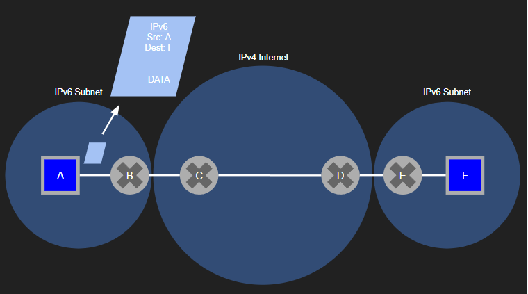
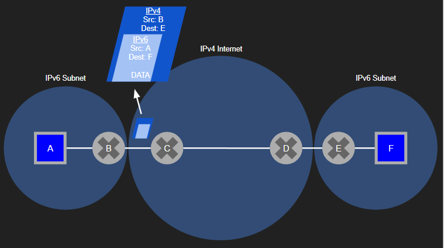
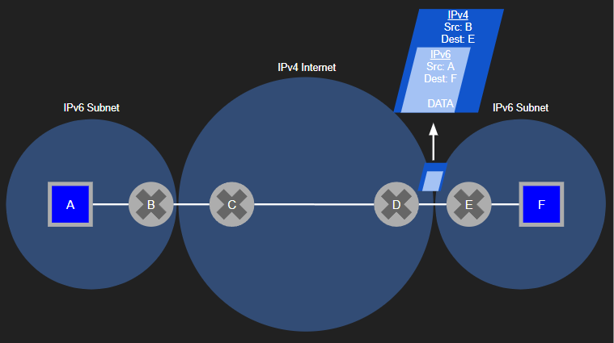
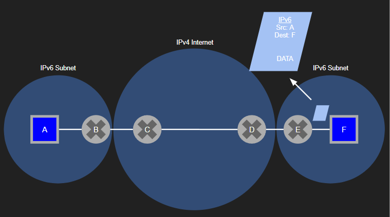

# Week Eight: More Network Layer: More Data Plane

## Learning Goals

### I can explain the problem that NAT solves, and how it solves that problem

#### The Problem

Under IPv4 there are not enough IP addresses for all devices. If every device on earth had its own IPv4 address there would be duplicate devices and subnets and packet delivery would be a mess. Routers would try to forward packets from one subnet to another and if their prefixes were the same then the routers forwarding tables, in conjunction with longest prefix matching, would have difficulty finding which host, or worse, subnet, the packet should be delivered to.

#### The Solution

Network Address Translation allows gateway routers to have a single public IP and then translate traffic coming in and out of the subnet where IPs may match other subnets.

The Gateway router to a subnet has an IPv4 address and is seen by the rest of the internet as a single host, it requires an individual IP that does not conflict with anything in the core of the internet. This reduces the number of IP addresses that are needed to connect the edge of the internet to the internet core. Behind gateway routers private IPs defined in [RFC 1918](https://datatracker.ietf.org/doc/html/rfc1918#section-3) that can be allocated to hosts. This allows any gateway router to allocate up to 65 thousand hosts. This system works because of Network Address Translation. NAT works so that while IPs behind gateway routers may be identical because they are allocated from the same private IP bank, they never conflict thanks to their gateway router translating all information that is sent in and out of the network. When the hosts send packets through the gateway router the router logs the original destination and source information in its NAT table. It then routes the packets using its own IP as the source to the core of the internet. The datagram arrives at the destination via longest prefix matching and is then routed back to the gateway router that initially sent the request. When a response is then received at the gateway router the router checks the source against its NAT table. In the table it will find that one of the host's private IPs in its subnet is logged to the source of the response it just received. The router forwards the datagram and the host receives it's response.

### I can explain important differences between IPv4 and IPv6

IPv4 was the initial addressing system for the network layer. Each datagram had a 32-bit source and destination address in its header. The first field of this header however allows a host to specifiy the type of datagram. This is because the developers of the Internet Protocol knew that advancement and change would ultimately lead the IP header having different interpretations. They also knew that the whole internet may interpret the data differently in different ways. The version number allows older hosts and routers to recieve newer datagrams and process them the same as they would with older headers. When the datagram reaches a newer host or router they will know the new version number and can decapsulate a newer datagram. The creators of IPv4 were right and a new protocol, IPv6 was introduced.

IPv6 was introduced to solve two issues. Primarily, there were not enough IPv4 addresses for the entire internet of devices, with 32 bits only just over four billion quniue addresses, less than the number of humans. Secondly, IPv4 had a lot of outdated header fields so the developers of IPv6 took the opportunity to adjust these.

IPv6 changes by header field

| Feature in IPv4                  | Changes in IPv6                                                                                                                                                      |
| :------------------------------- | :------------------------------------------------------------------------------------------------------------------------------------------------------------------- |
| 32 bit address length            | 128 bit address that is expanded to have enough addresses for near infinite devices                                                                                  |
| Version field                    | Changed to allow backwards compatibility for IPv6 hosts and allows IPv6 to be routed through IPv4                                                                     |
| Type of Service                  | Traffic class field allows priority for different types of service                                                                                                   |
| Protocol field                   | Next header field identifies the protocol of the datagram contents.                                                                                                  |
| Source and destination addresses | In IPv6 the headers are defined by [RFC 4291](https://datatracker.ietf.org/doc/html/rfc4291#section-2) as a string of eight hex digits separated by colons           |
| Fragmentation and reassembly     | IPv6 doesn't not allow for fragmentation so if datagrams are too big the source and destination rely on "Packet Too Big" ICMP messages to resize packets accordingly |
| Header checksum                  | Removed in IPv6 because the transport and link layers preform checksumming so it was overly redundant to keep checking on the network layer as well.                 |
| Options                          | Removed in IPv6 to keep the header to 40 bytes fixed length and fixed length header that is significantly shorter than IPv4. The options could be added to the TCP or UDP header and accessed via the next header field      |

### I can explain how IPv6 datagrams can be sent over networks that only support IPv4

IPv6 hosts use tunneling to send IPv6 data over IPv4 networks. The IPv6 sending host sends an IPv4 header with IPv6 header in the payload. The datagram is routed normally as an IPv4 address through the network until it reaches the IPv6 host receiver. When it reaches the receiver the receiver sees that the protocol number in the IPv4 header is 41. This indicates that it is actually an IPv6 datagram. The host then extracts the IPv6 datagram from the payload and routes it as if it had received the IPv6 directly from the sender.

#### Tunneling example

1. Host A, IPv6, sends an IPv6 datagram.  

2. Router B sees it is an IPv6 datagram but knows it must be routed through an IPv4 internet. The router wraps the datagram and sends it as protcol 41.  

3. After tunneling through the internet as an IPv4 packet the packet reaches router E, the gateway router to an IPv6 subnet.  

4. Router E extracts the IPv6 packet and forwards it into the subnet where it continues to its destination as an IPv6 packet.  
