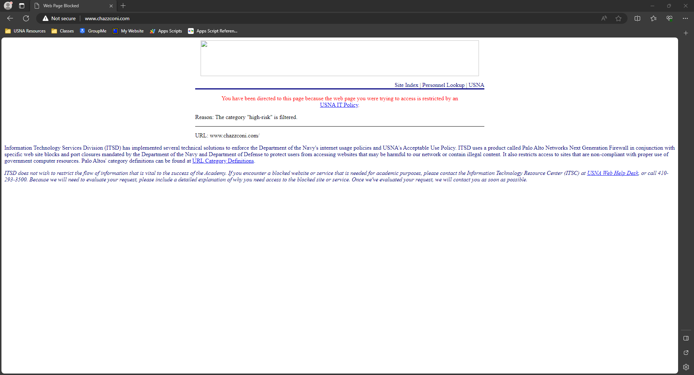

# Week Nine: Network Layer: Control Plane

## Lab: Loopbacker: Week 3 Register a Domain Name

### Introduction

In this lab I registered a Domain Name and answered some questions about DNS on the way there. My website does not work at USNA because USNA DNS servers were built by satan himself. My web site can be accessed from anywhere else though. I know this because I had my family in California access it and I accessed it on my phone.

Here is what happens when I try to access my website in internet explorer and chrome on USNA internet.


### Collaboration

[David Kreidler told me to use this guide to help me. It was not very helpful but that was nice of him.](https://docs.aws.amazon.com/AmazonS3/latest/userguide/website-hosting-custom-domain-walkthrough.html#root-domain-walkthrough-before-you-begin) 

### Process

I logged onto AWS and registered an account. Then I paid the astronomical price of $13 for the domain name [www.chazzconi.com](www.chazzconi.com).

### Questions

#### You should probably sign up for "Domain Privacy". What is this, and why should you sign up for it?

Domain privacy hides personal information about your website and the domain registrant from public WHOIS databases. The WHOIS database gets its information from the ICANN registration data for every registered domain. It does this by replacing your information with the registrars information. [I used this source to answer this question.](https://www.nexcess.net/blog/do-you-need-domain-privacy-protection/#:~:text=Domain%20privacy%20protection%20is%20a,when%20purchasing%20a%20domain%20name.)

#### If you have a server with an IP address of 77.97.5.74 and a domain name ic322.com, what DNS record would you use to configure your website?

DNS Record type A which maps an IP to a domain name. It does this by containing a domain in the name felid and an IP address in the value field. The purpose of this record is for standard hostname-to-IP mapping.

```text
Name: ic322.com
Value: 77.97.5.74
Type: A
```

#### If you have a website that is already accessible at m091890.gitlab.io/ic322-computer-networks, and you registered a domain ic322.com, what DNS record would you use to configure your website?

DNS record type CNAME which maps an alias hostname to a canonical hostname. This means that the alias, the new website, would be mapped to the cannonical, the existing website.

```text
Name: ic322.com
Value: m091890.gitlab.io/ic322-computer-networks
Type: CNAME
```

#### The Gitlab Pages instructions use a TXT record to verify ownership of the domain name. The book does not cover TXT records. What are they?

A [TXT record](https://www.cloudflare.com/learning/dns/dns-records/dns-txt-record/) is a type of DNS record that allows a domain admin put plaintext into DNS records. This was originally made for just humans to read but you can now also add machine readable data into txt records. One domain can have many TXT records. They are often used for spam email prevention and domain ownership verification. This is done by wrapping a TXT record into an SPF, DKIM, or DMARC record which places lists of authorized servers, public keys, or defines SPF or DKIM  policies into a TXT record.

```text
Name: chazzconi.com
Value: Hi welcome to my domain!
Type: CNAME
```

#### What were the DNS records you set up?

In route 53 I set up two records:

1. Type A: chazzconi.com maps my domain to the AWS storage
2. Type A: www.chazzconi.com maps to my root domain where its stored on AWS.

#### Who owns the following DNS servers for your website?

1. Root: VeriSign Global Registry Services
2. TLD: COM
3. Authoritative: chazzconi
 
#### If you register a domain like gonavy.com, and have a mail server running at IP 34.234.11.05, what DNS records would you need to create in order for mail addressed to `bill@beatarmy.com` to be delivered to your mail server?

An [MX record](https://www.cloudflare.com/learning/dns/dns-records/dns-mx-record/) would redirect mail sent to `bill@beatarmy.com` to your domain gonavy.com.

```text
Name: gonavy.com
Value: bill@beatarmy.com
Type: MX
```
