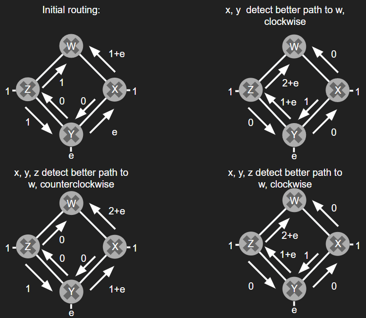
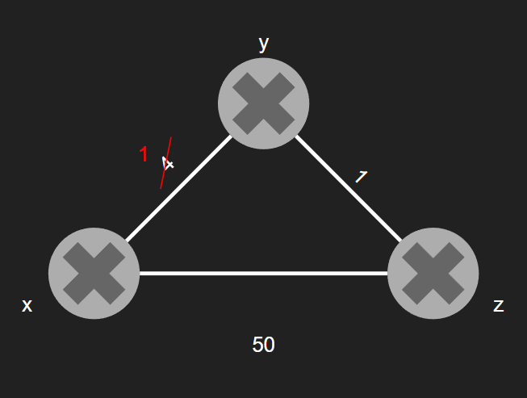

# Week Nine: Network Layer: Control Plane

## Learning Goals

### I can describe how Link State algorithms work, their advantages, their common problems and how the problems are addressed. I can also give an example of a protocol based on the Link State algorithm

Link state algorithms are centralized routing algorithms, meaning that they require complete, global knowledge of the entire network before they can be run. The calculation is then run from on machine and distributed to all routers or run in each router individually. Typically, all routers receive the global knowledge via link-state broadcasts containing identities and costs of links to all other routers.

#### Link State Function

The Link State algorithm calculates the least cost path between a source and a destination in a network. Because link state is a centralized algorithm, all of the routers will have the same calculated best cost path through the network for any source and destination.

#### Link State Advantages

One advantage of link state is that it can be fast running at n^2 unoptimized and log(n) optimized. They are also reliable if oscillations are prevented using random link advertisement.

#### Link State Common Problems

One common problem in link state algorithms is oscillations. When link costs are not equal in both directions, the routers will continually route, and reroute packets in opposite directions. This is because as the packets each different routers they see different costs based on direction and assume new paths are cheaper resulting in oscilations.  
  

this problem can be solved by having routers randomly send out link advertisement of new routing paths so that the routers do not sync up and rotate back and forth between paths

#### Link State Example Protocol

One example link state protocol is OSPF.

### I can describe how Distance Vector algorithms work, their advantages, their common problems and how the problems are addressed. I can also give an example of a protocol based on the Distance Vector algorithm

The distance vector algorithm is distributive. Opposted to link state, distance vector is iterative and asynchronous. Each router preforms a loop of three steps to map the network and understand connections beyond their own. The router receives information from its direct neighbor about their shortest paths, calculates its shortest paths based on that information, and sends out its update calculations to its neighbors. This loop stops once no more new information is being passed between routers.

#### Distance Vector algorithms Function

Distance vector algorithm calculates the distance to every router from every router via iterative loops of distance table messages, calculation, and redistribution. This way each router can map the network on their own.

#### Distance Vector algorithms Advantages

Distance vector algorithms are advantageous because of their distributed, self stopping nature. Routers will only notify their neighbors when necessary, reducing network traffic. No central authority or message needs to let the routers know they should stop iterating.  

  

Distance vector is also good for ensuring that faster link updates are found and inputted into routing quickly. In the example above when y detects the cost change All that needs to happen next is z will update its table and send the information back to y but y already has the fastest costs so it doesn't need to update and all of the routers are updated in one loop.

#### Distance Vector algorithms Common Problems

Conversely to when link updates get faster, a common problem is "bad news travels slow" in distance vector algorithms. When a link is updated to a greater distance, the router attached to the link will update its table and send this information to its neighbors. Unfortunately, this causes a miscommunication where the original router looks at its neighbors and sees there is a faster route but that route was the orignal route that has been updated, it just doesn't know this yet. When the neighboring routers receive this information, they update their paths, but only increment the new value by whatever cost it takes to get to the router attached to the update. This causes an iterative loop to run until both routers realize where exactly the updated link is.

A solution to this is poisoned reverse. In this scenario when a router detects a higher edge cost and sends an update to its neihbors, the neihbors will pretend that any route they had through the original router has a distance of zero, forcing the original router to take the higher cost route and properly calculate the hugher new path cost around the link in one update.

#### Distance Vector algorithms Example Protocol

One example distance vector protocol is RIP
