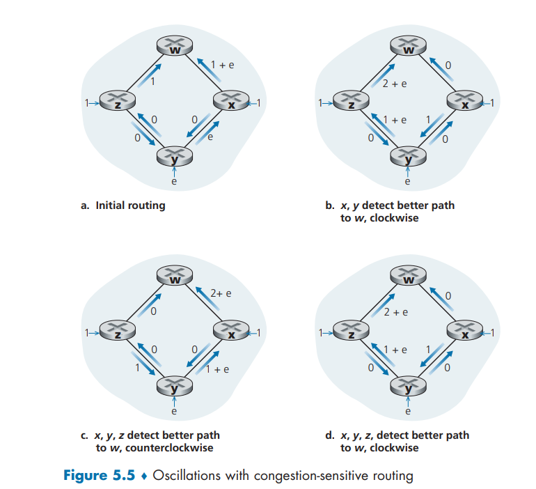

# Week Nine: Network Layer: Control Plane

## Learning Goals

### I can describe how Link State algorithms work, their advantages, their common problems and how the problems are addressed. I can also give an example of a protocol based on the Link State algorithm

Link state algorithms are centralized routing algorithms, meaning that they require complete, global knowledge of the entire network before they can be run. The calculation is then run from on machine and distributed to all routers or run in each router individually. Typically, all routers receive the global knowledge via link-state broadcasts containing identities and costs of links to all other routers.

#### Link State Function

The Link State algorithm calculates the least cost path between a source and a destination in a network. Because link state is a centralized algorithm, all of the routers will have the same calculated best cost path through the network for any source and destination.

#### Link State Advantages

One advantage of link state is that it can be fast running at n^2 unoptimized and log(n) optomized. They are also reliable if oscillations are prevented using random link advertisement. Link state is also good for ensuring that faster link updates are found and inputed into routing quickly.

#### Link State Common Problems

One common problem in link state algorithms is oscillations. When link costs are not equal in both directions, the routers will continually route, and reroute packets in opposite directions. This is because as the packets each different routers they see different costs based on direction and assume new paths are cheaper resulting in oscilations.  

Another common problem is "bad news travels slow" in link state algorithms. When a link is updated to a greater distance, the algorithm will recalcuate to route around that greater distance. This doesn't take into account for possibly greater distances in other paths. This causes the routers to route through the even greater distances and recalculate each time they route until they have reached the same cost as the updated link.

Both of these problems can be solved by having routers randomly send out link advertisement of new routing paths so that the routers do not sync up and rotate back and forth between paths

#### Link State Example Protocol

### I can describe how Distance Vector algorithms work, their advantages, their common problems and how the problems are addressed. I can also give an example of a protocol based on the Distance Vector algorithm

#### Distance Vector algorithms Function

#### Distance Vector algorithms Advantages

#### Distance Vector algorithms Common Problems

#### Distance Vector algorithms Example Protocol
