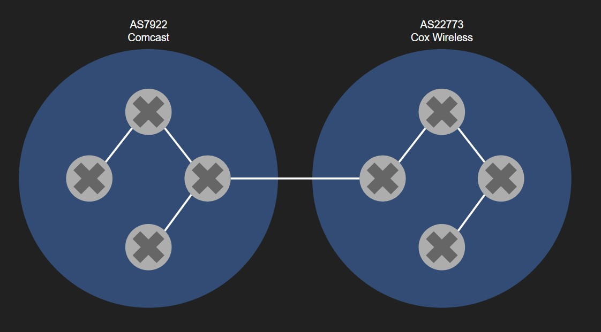
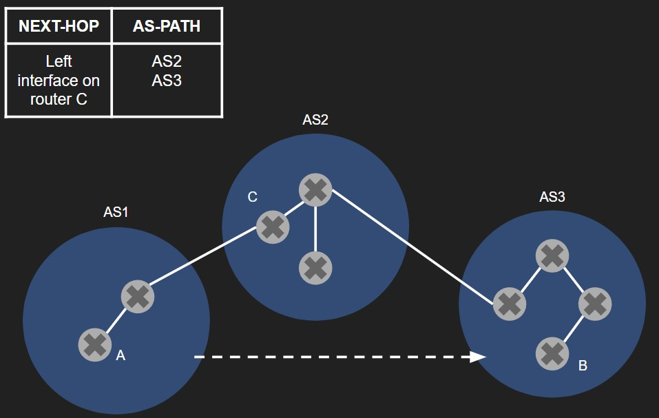

# Week Ten: Network Layer: More Control Plane

## Learning Goals

### I can explain what autonomous systems are and their significance to the Internet

In most internet senarios all routers cannot be simply seen as just indistinguishable from each other all executing the same routing algorithm. This is too simplistic for two reasons:

1. **Scale:** With larger numbers of routers the resources required to communicate, compute, and store routing information becomes limiting. The current internet core has millions of routers. Broadcasting information about cost updates and storing all of the data for routing information would take a massive amount of resources. A distance-vector algorithum that iterated over the millions of routers would not function.
2. **Administrative autonomy:** The internet is made up of multiple ISPs at different levels that control a group of routers interconnected with other ISPs. ISPs prefer to manage the connections going in and out of their network as well as different subsections of routers within their network. Because of this it is too simple to look at all routers the same because then all ISPs would have no control over the data that flows through their territory.

Organizing routers int Autonomous Systems (ASs) solves bot of these problems. An AS is a grouping of routers that all fall under the control of one administrator or ISP. A typical AS contains all of the routers in an ISP an the links that connect them. Larger ISPs will divide up their AS into multiple ASs. These AS's are almost like massive routers that represent the bounds between ISP domains in the internet. As a result they are all identifiable by their [AS number](https://www.icann.org/en/icann-acronyms-and-terms/autonomous-system-number-en) like an IP address which is assigned by ICANN.

  

Example diagram of two interconnected ASs where each AS has an AS number and ISP controlling the routers within the AS.

### I can describe how the BGP protocol works as well as why and where it is used

Now that the internet is partitioned into ASs so that each ISP can manage the connection throughout their network and keep the overhead cost of managing the internet divided, it is important to acknoledge that ASs still need to communicate between each other. BGP, Border Gateway Protocol, is how ASs communicate with each other. BGP is a distance vector inter-AS routing protocol. Because it operates between ASs it is asynchronous.

BGP provdes each router a means to do two things:

1. **Obtain prefix reachability information from neighboring ASs:** BGP allows subnets to be seen from the routers in the internet core so they are not isolated in the edge.
2. **Determine the “best” routes to the prefixes:** BGP will use its distance vector algorithm to determine the best route if there are mutliple routes between ASs to a particular prefix. It will then combine this decision with policy created by the ISPs to find the "best" route.

BGP does these things using iBGP and eBGP. TCP connections between edge routers of ASs use eBGP connections. A connection between internal BGP routers is called iBGP. These connections advertize the exisitance of routers within an AS to another AS and the particular prefixes they can lead to via their forwarding abilities. When routers advertize prefix connections over a BGP connection the router sends BGP attributes. The two most important BGP attributes are AS-PATH and NEXT-HOP. AS-PATH contains a list of ASNs that the advertisement has traveled through. NEXT-HOP is the address of the router that started the AS-PATH list. Below an example of how AS-PATH and NEXT-HOP function for sending a message from router A to B from AS1 to AS3.

  

From here BGP uses hot potato routing to move packets from one AS to another as fast as possible. Using these two attributes BGP uses the following steps for its route selection algorithm:

>1. A route is assigned a **local preference** value as one of its attributes (in additionto the AS-PATH and NEXT-HOP attributes). The local preference of a route could have been set by the router or could have been learned from another router in the same AS. The value of the local preference attribute is a policy decision that is left entirely up to the AS’s network administrator. (We will shortly discuss BGP policy issues in some detail.) The routes with the highest local preference values are selected.
>2. From the remaining routes (all with the same highest local preference value), the route with the shortest AS-PATH is selected. If this rule were the only rule for route selection, then BGP would be using a DV algorithm for path determination, where the distance metric uses the number of AS hops rather than the number of router hops.
>3. From the remaining routes (all with the same highest local preference value and the same AS-PATH length), hot potato routing is used, that is, the route with the closest NEXT-HOP router is selected.
>4. If more than one route still remains, the router uses BGP identifiers to select the route.

### I can explain what the ICMP protocol is used for, with concrete examples

ICMP, Internet Control Message Protocol, is used by hosts and routers to transmit network-layer information to each other.
Its uses are detailed in [RFC 792](https://datatracker.ietf.org/doc/html/rfc792):
> ICMP messages are sent in several situations: for example, when a datagram cannot reach its destination, when the gateway does not have the buffering capacity to forward a datagram, and when the gateway can direct the host to send traffic on a shorter route.

Clearly the main objective of ICMP is for reporting network layer problems within the internet. This is done primarly through the ICMP header which contains a time to live in seconds. This field is decremented at each node it passes through. One example of ICMP usage is the destination network unreachable message. If a router cannot find a host requested by another host in time then it will send and ICMP message and send it to the original host letting them know their destionation cannot be found.

ICMP is commonly used in the traceroute program and the ping program. This allows users to see the route their datagram traveled over the geographic space of the world. It also allows users to determine the time it took between their host and the host they are locating. These programs are implemented using ICMPs TTL field. A host that initiates trace route or ping will send UDP packets to each router with ICMP messages. As the messages TTL field expires the sending host can calculate the time to each router in the path. Eventually, when the message gets to a subnet the port number will be unknown and a destination network unreachable message is sent back. Using this message traceroute can log all of the routers plus the destination originally supplied to determine the route. Ping can calculate the time from each TTL expiration.
