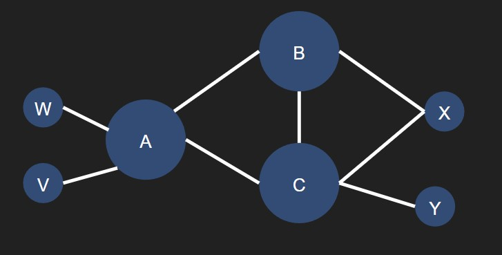

# Week Ten: Network Layer: More Control Plane

## Review Questions

### R11: How does BGP use the NEXT-HOP attribute? How does it use the AS-PATH attribute?

NEXT-HOP is the address of the router that started the AS-PATH list. BGP uses it to update the forwarding tables of routers for inter-AS communcation.

### R13: True or false: When a BGP router receives an advertised path from its neighbor, it must add its own identity to the received path and then send that new path on to all of its neighbors. Explain

False, BGP includes policy in its routing decisions so a router will choose to add its identity to the received path and choose which neighbors it sends to via eBGP.

### R19(describe what they are used for): Name four different types of ICMP messages

| ICMP Type | Code | Description |
|----------|----------|----------|
| 0 | 0 | Echo reply: Generated in response to an echo request; used when pinging a host |
| 3 | 0 | Destination network unreachable: Host in destination address does not exists or cannot be accessed from that gateway router |
| 8 | 0 | Echo Request: Data that is expected to be received back in an echo reply "pong" |
| 9 | 0 | Router advertisement: Broadcasted by a router on a LAN with its IP address as available for routing |

### R20: What two types of ICMP messages are received at the sending host executing the Traceroute program?

1. Type 3: Port unreachable
2. Type 11: TTL expired

### P14: Consider the network shown below. Suppose AS3 and AS2 are running OSPF for their intra-AS routing protocol. Suppose AS1 and AS4 are running RIP for their intra-AS routing protocol. Suppose eBGP and iBGP are used for the inter-AS routing protocol. Initially suppose there is no physical link between AS2 and AS4.

**a.** Router 3c learns about prefix x from which routing protocol: OSPF, RIP, eBGP, or iBGP?
eBGP

**b.** Router 3a learns about x from which routing protocol?
iBGP

**c.** Router 1c learns about x from which routing protocol?
eBGP

**d.** Router 1d learns about x from which routing protocol?
iBGP

### P15: Referring to the previous problem, once router 1d learns about x it will put an entry (x, I) in its forwarding table.

**a.** Will $I$ be equal to $I_{1}$ or $I_{2}$ for this entry? Explain why in one sentence.
$I = I_{1}$ because AS4 and AS2 are not linked physically so it cannot be routed through AS2 and must go through AS3.

**b.** Now suppose that there is a physical link between AS2 and AS4, shown by the dotted line. Suppose router 1d learns that x is accessible via AS2 as well as via AS3. Will I be set to I1 or I2? Explain why in one sentence.
$I = I_{1}$ because as long as there is no policy against it hot potato routing will send through AS2 to AS3 to move the message out of the AS as fast as possible.

**c.** Now suppose there is another AS, called AS5, which lies on the path between AS2 and AS4 (not shown in diagram). Suppose router 1d learns that x is accessible via AS2 AS5 AS4 as well as via AS3 AS4. Will I be set to $I_{1}$ or $I_{2}$? Explain why in one sentence.

$I = I_{2}$ because although AS-PATH is shorter for AS3 AS4, AS2 AS5 AS4 will move the message out of the AS faster unless policy dictates otherwise.

### P19: In Figure 5.13, suppose that there is another stub network V that is a customer of ISP A. Suppose that B and C have a peering relationship, and A is a customer of both B and C. Suppose that A would like to have the traffic destined to W to come from B only, and the traffic destined to V from either B or C. How should A advertise its routes to B and C? What AS routes does C receive?

  

A should advertize its routes to B only because regardless of the source or destination all traffic avoids C. C has routes CBA, BAW, BAV.

### P20: Suppose ASs X and Z are not directly connected but instead are connected by AS Y. Further suppose that X has a peering agreement with Y, and that Y has a peering agreement with Z. Finally, suppose that Z wants to transit all of Y’s traffic but does not want to transit X’s traffic. Does BGP allow Z to implement this policy?

BGP does not allow this policy to be implemented because there is no master node that can communicate this policy between x and zs traffic. All of the traffic will appear to be Ys traffic.