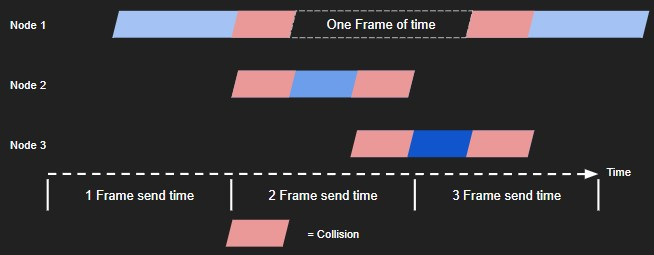
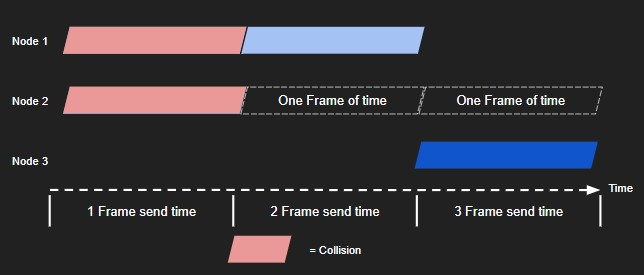
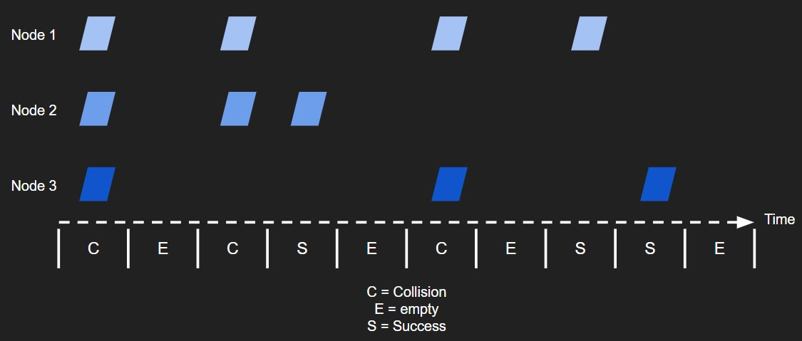
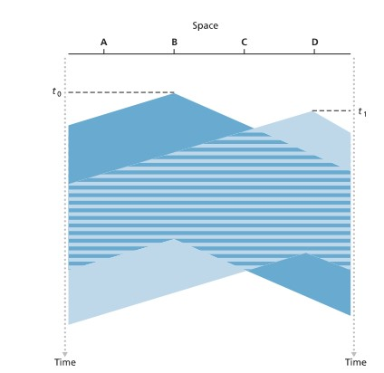
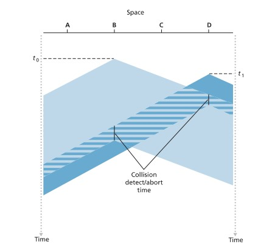

# Week Twelve: Link Layer

## Learning Goals

### I can explain the ALOHA and CSMA/CD protocols and how they solve the multiple-access problem

The multiple-access problem is navigating how to best schedule sending and receiving nodes over a shared medium. If multiple nodes try to transmit at the same time the medium will become congested and all signals that travel over the medium will be unusable.

Attempts to solve this problem balance prioritizing throughput for a single node, throughput for multiple nodes, decentralization, and simplicity.

#### ALOHA Protocol

The ALOHA Protocol functions by letting any node that has data to send send data. This causes collisions but the protocol assumes that most of the time the medium is quiet and TCP will resolve collisions. If there is a collision then the nodes that collided both rebroadcast with a probability $p$. If they do not rebroadcast due to probability then they will wait for the amount of time it takes to send one frame and then rebroadcast again with probabaility $p-1$. Below two example senarios highlight ALOHAs attempts to deconflict congested frames.



Here three nodes attempt to send frames but they all end up colliding. Node 1 that collided does not achieve probablity p when it tries to rebroadcast so it must wait one frame lenght. Unfortunately once it is done waiting a third node begins to send.



Here, because there is enough silence, both nodes one and 3 are able to send their frames without collisions. Node two tries to rebroadcast twice but doesn't achieve p or 1-p.

Here ALOHA prioritizes the throughput of individual nodes where if the medium is silent then every node will have a throughput of $R$ bits per second. If multiple nodes are sendind however the maximum efficency of the protocol is $1/(2e)$. This is half of another similar protocol, slotted ALOHA (diagrammed below) which uses TDM alongside the regular ALOHA protocol.



While this appears to make ALOHA less optimal, ALOHA requires no synchonization of clocks so it is fully decentralized and is simpler to set up than slotted ALOHA.

#### CSMA/CD Protocol

CSMA/CD stands for Carrier Sense Multiple Access. / Collision Detection. Unlike ALOHA, CSMA puts heavy priority on avoiding collisions by ensuring that nodes listen to the medium before sending frames. To do this CSMA piriotites two things that are similar to human conversation.

1. **Listen before speaking**: Before transmitting each node myst scan the medium and make sure it is quiet before transmitting. This is known as carrier sensing.
2. **Stop talking if someone else is talking**: If a node does sense another transmission on the medium while it is transmitting it will stop tranmsitting, also known as collision detection.

While this objective may seem simple it can be difficult to implement when considering issues of propagation delay. Illustrated below is a scenario where propagation causes multiple nodes to believe the medium is free when in reality another node has started broadcasting but the sound from each node hasn't reached each other. Show below we can see this exact conundrum where A has started broadcasting but D thinks the medium is open because the transmission has not reached D yet.



This scenario illustrates the main challenge CSMA/CD faces. To avoid this issue CSMA/CD follows three steps to ensure that if collisions are detected, two nodes hear each other while broadcasting, the frames stop sending and the medium is freed up.

1. A node prepares a frame in their adapter buffer
2. If the node see that the channel is idle it will transmit the frame - if the channel is busy the node waits untl it is idle and then sends.
3. While transmitting the node checks to see if an incoming transmission is causing interference.
4. If the frame is sent without any detection the node is done otherwise the node stops trasmitting upon detection.
5. If the node detected a transmission then it waits a random time returns to step 2



### I can compare and contrast various error correction and detection schemes, including parity bits, 2D parity, the Internet Checksum, and CRC

#### Parity Bits

The simplest form of error detection is parity bits. For Data $D$ of length *d* parity bits parity bits adds one extra bit. The meaning of this bit depends on the type of parity scheme.

In an **even** parity scheme the sender includes one additional bit that makes the total number of ones within $D$ and the parity bit even.

In an **odd** parity scheme the sender includes one additional bit so that the total number of ones within $D$ and the parity bit odd.

The parity scheme is simple but offers little in the way of detection. If more than one bit is flipped the data will appear correct. It offers no correction as it is not possible to tell what bit flipped.

```text
Even Parity Scheme with no errors:
(OR POSSIBLY ANY EVEN NUMBER OF ERRORS)
01110001101010111
\______________/|
        |        \
    d data bits   parity bit
```

#### 2D Parity

2D parity is one step above regular parity bits. Here the data d is divided into rows of length i and length j. The data is then placed into a matrix where a parity bit is calculated using even or odd parity for every row and column.

```text
     Row parity
  --------------->
c | d1,1 ... d1,j | d1,j+1
o | d2,1 ... d2,j | d2,j+1
l | ...  ...  ... | ...
p | di,1 ... di,j | di,j+1
a |---------------+-------
r | di+1,1...di+1,j| di+1,j+1
i |
t |
y |
  |
 \ /
```

By using this scheme parity can be used to detect up to two errors and correct up to one error. This is critical to ensuring both the correct message is received and can be quickly fixed. In the context of the link layer over Ethernet errors are very small with $10^{-10}$ BER in gigabit Ethernet so this is somewhat effective.

```text
CORRECTING ONE ERROR BIT:
 1  0  1 0 1 | 1
 1 [0] 1 1 0 | [0] <- error in row detected
 0  1  1 1 0 | 1
-----------+---
 0 [0] 1 0 1 | 0
    /\
  error in
  column
```

Here one bit is detected because both the row and column parity bits are incorrect. This single bit is the error bit so flipping it will correct the error. This correction is known as forward error correction (FEC)

#### Internet Checksum

Internet Checksum is a subset of check sum methods in general. In check sums *d* bits of data are divided into *k*-bit integers. In the Internet Checksum bytes of data are treated as 16 bit integers and summed. The ones complement of the sum forms the internet checksum that is carried in the segment header. The receiver then applies the ones complement of the sum of the received data including the checksum and sees if it is all 0s. If any bits are 1 there is an error.

```text
                                EXAMPLE INTERNET CHECKSUM

01101001 01101110 01110100 01100101 01110010 01101110 01100101 01110100 00101110 00000000
\_______________/ \_______________/ \_______________/ \_______________/ \_______________/
      26990      +      29797      +      29294      +      25972      +      11776
                                        = 123829
                                        =11110001110110101
                      Ones Complement -->00001110001001010
                  (internet checksum)                                  
```

The internet checksum is most important to understand in terms of the layer it is implemented. The transport layer is primarily software so taking the time to calculate simple internet checksums is easy. Doing a check like CRC would take valuable resources in software. A more complicated check like CRC is best implemented in the link layer where dedicated hardware can easily and quickly detect errors.

#### CRC

CRC or Cyclic Redundancy Checks are the most complicated error correction and detection algorithms known to man. CRC checks use G, a generator to detect bursts of errors using a formula. For CRC checks the following formula is used to calculate a remainder $R$. Where $r = len(G)-1$. When using this formula binary division is used where each remainder is XOR'd with the generator.
$$R=remainder\frac{D*2^r}{G}$$

International standards are defined for 8-,12-,16- and 23-bit G. The 32-bit CRC standard is most prevalant in link layer protocols and uses the following generator:
$$G_{CRC-32} = 100000100110000010001110110110111$$

In CRC because of the way the math works CRC can detect burst errors of fewer than $r + 1$ bits. It can also detect errors of greater than $r + 1$ with a probability $1 -0.5^r$ and any odd number of bit errors.

Example CRC $D = 0110100011$ --> $R = 0001$

```text
      ______110111111
10011 )01101000110000
        10011        
         10100       
         10011       
           1110      
           0000      
           11101     
           10011     
            11101    
            10011    
             11100   
             10011   
              11110  
              10011  
               11010 
               10011 
                10010
                10011
                    1

```

More examples on the [questions page](review_questions12.md)

### I can describe the Ethernet protocol including how it implements each of the Layer 2 services and how different versions of Ethernet differ

Ethernet originally had to compete with other link level protocols for dominance in LAN. Over time the service became a physical commodity making it relatively cheap to implement. Further assisting its development was its ability to keep increasing speed throughout its history.

Ethernet began as a coaxial bus to interconnect nodes in the mid-1970s. This technology was a broadcast LAN which led to many collisions and promoted the use of collision avoidance protocols like CSMA/CD. By the late 1990s most companies and unviersities used this Ethernet model. At this time Ethernet was still in its infancy because each hub in a LAN simply copied bits over wire rather than processing frames.

The early 2000s brought the a major change to Ehternet, hubs were replaced by switches, a "collision-less" store-and-forward packet switch that only operated on layer 2. This allowed LANs to take full advantage of the Ethernet frame and header

Ethernet implements the Layer 2 services in its header. Each element of the header coresponds to how Ethernet is able to use Layer 2 MAC addresses to move packets from source to destination in a subnet.

**Ethernet Header Fields:**

| Preamble | Destination Address | Source Address | Type | Data | CRC |
|----------|----------------------|-----------------|------|------|-----|
|Always `10101011`. The first 7 bits wake the recieveing adapters up and synchornoze their clocks to that of the sender's clock. The last two `11` bits lets the adapter know the header comes next now that it is awake.|           MAC address if the destination adapter. ARP protocol determines the proper address within the subnet. As this frame travels over Ethernet switches will use this address to determine where to deliver the frame.|MAC address if the source adapter. ARP protocol determines the proper address within the subnet.|Note that not all layer 3 datagrams are IP. This allows ethernet to determine the type of layer 3 datagram packaged within the data field of this frame.|1500 bytes of data carrying the IP datagram. If IP datagrams passed to layer 2 are > 1500 bytes they will be fragmented into multiple frames|Cyclic Redundancy check, "R" from the earlier section.|

#### Different Versions of Ethernet Implemented at the Physical Layer

Each different version of ethernet is an acronym, an example is diagrammed below.

**40GBASE-T**
| 40 | G | BASE | - | T |
|----|---|------|---|---|
| 40 bits/s| Gigabit speed | baseband Ethernet | - | Twisted Pair |
| Speed of Ethernet in bits per second | No G is included if the speed is in megabits. | Physical medium only carries Ethernet traffic, almost all IEEE ethernet uses baseband. | - | Physical medium carrying wire: no letter = coax, SX = multimode fiber, FX = fiber optic, BX = gigabit fiber optic. |