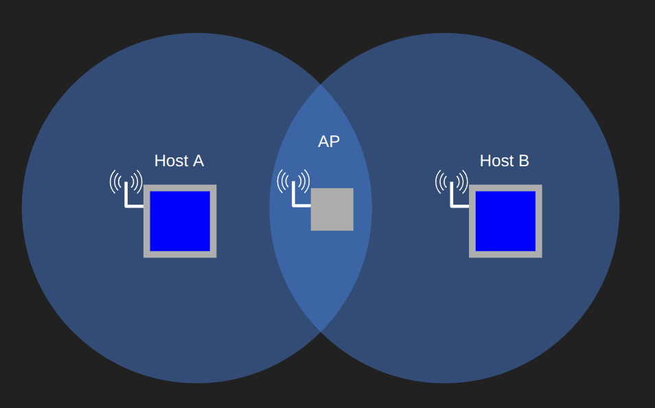

# Week Thirteen: More Link Layer

## Learning Goals

### I can describe the role a switch plays in a computer network

The role of the switch is to receive incoming link-layer frames and forward them onto outgoing links. The switch acts within a subnet to deliver frames between hosts or to a gateway router. The switch is easy to use because it is plug and play, once it is inserted into a network it builds its own table for forwarding. The switch does this by storing the source MAC address of frames with the interface they came in on and the time they came in. Entries are then given a certain amount of time, called aging time, that another frame must pass through the switch from that MAC address validating the MAC address is still within the network. If an entry is not validated via frames coming through the switch within the aging time the entry is deleted. In the picture below the switch has built its table by observing packets passing from host with MAC address `AA-AA-AA-AA-AA-AA` to host `BB-BB-BB-BB-BB-BB`.


As far as hosts and routers are concerned, switches are invisible. When frames must pass through a switch the switch takes care of everything it needs in the link layer. The two primary functions of switches are forwarding and filtering. When a switch receives a frame it must decide if it is going to forward the frame onto one of its interfaces or filter it by dropping it. Theses decisions follow the table below.

| Case                                                  | Result                                                      |
|-------------------------------------------------------|-------------------------------------------------------------|
| Frame on interface x with destination not in switch table | Broadcast frame to all interfaces except for x |
| Frame on interface x with destination in switch table   | Forward frame to the corresponding interface                 |
| Frame on interface x with destination of interface x   | Drop the frame (prevent forwarding to the same interface)     |

Although switches forward similar to routers, switches are different from routers because they use MAC addresses making a switch a layer 2 packet switch where a router is a layer three packet switch.

One final special property of switches is they can be can be used to create VLANs to separate traffic. This is done by dividing the interfaces in a switch into different Virtual LANs so one switch essentially acts as two separated switches. This can be combined with a router to connect the VLANs within a single switch but require the initialized (rather than automatic) routing of a router.

Advantages of switches:  
Elimination of collisions: switches will buffer frames and never transmit multiple frames on a segment at a time  
Heterogeneous links: different speeds of switches can be connected to one switch.  
Management: switches prevent one downed connection from taking down the network and can block jabbering adapters  

### I can explain the problem ARP solves, how it solves the problem, and can simulate an ARP table given a simple LAN scenario

Address Resolution Protocol translates IP addresses to link-layer addresses. Like DNS, ARP can resolve host IPs to MAC addresses. Unlike DNS which can resolve any domain in the internet to an IP ARP is only used for the local subnet.

ARP does its translations via ARP tables stored in hosts and routers. The ARP tables contain three fields: IP Address, MAC Address, and Time To Live. Hosts and routers build their ARP tables using ARP packets. ARP packets includes sending and receiving IP and MAC addresses. These ARP packets are clasified as query or response packets. Query packets are sent using the MAC broadcast address `FF-FF-FF-FF-FF-FF` which will transmit the frame everywhere on the subnet so that each host and router can check if the destination IP address in the ARP packet matches their IP. If it does, they will respond with a ARP response to the MAC address of the source of the query packet. Both hosts will update their ARP tables accordingly when the packets are sent back and forth. If no packets revalidate the need for the entry in the ARP table then it will be deleted after the Time to Live value expires.

#### Example ARP simulation


Here host B has sent out an ARP request for IP ```111.111.111.110``` and for an IP outside the subnet. In both cases the requests where broadcast along the network. For the first request, Host A identified it has MAC address ```AAA-AAA-AAA-AAA-AAA-AAA``` and sent a response ../week12/review_questions12.mdto host B to log in its ARP table. Int he second request the router received the IP and identified that it was not in the subnet and responded with its IP and MAC address.

### I can explain CSMA/CA, how it differs from CSMA/CD, what problems it addresses, and how it solves them

CSMA/CA is a random access protocol, a subset of multiple access protocols. In a random access protocol transmitting nodes always use the full throughput of the channel. After transmitting during a collision CSMA/CA waits for a random time. While this is the same general operation as CSMA/CD there are some key differences

CSMA/CA or "Carrier Sense Multiple Access Collision Avoidance" is used because there are key differences between wifi and ethernet. In wifi there are high bit rate errors so it requires a link layer acknoledgment scheme. In ethernet collisions are detected and then the transmission must stop. This isnt possible in wifi because wifi cant detect collisions while sending. The incoming signal is too weak and it is costly to detect. Even if an adapter could listen and transmit wouldn't be able to detect all transmissions due to the hidden terminal problem. For these reasons a CSMA/CA provides a different random access framework with acknoledgments and without detection.

The bottom line differnece between CSMA/CA and CSMA/CD is that **entire frames are broadcast regardless of collision.** This situation forces wifi to prioritize avoiding collisions to begin with.

CSMA/CA avoids collisions by following these steps:

1. If channel is idle station waits one Distributed Inter-frame Space (DIFS).
2. If the channel is busy then the station choses a random backoff value using binary exponential backoff. This value only counts down after DIFS and if the channel is idle
3. When counter reaches 0 station transmits the entire fame and waits for an ACK.
4. If an ACK is received transmitting station knows frame reached its destination. If it has another frame to send then it goes through step 2. It specifically doesn't go to step 1 in case there is a hidden terminal and the station can't tell the channel is busy. If no ACK comes back the transmitting station goes back to step two as if it collided with a larger backoff interval.

One last element if CSMA/CA is RTS and CTS. If a terminal is hidden from other terminals then it has no way of sensing that the channel is busy and will broadcast/count down even when the channel is busy but it just cant hear the other station that is currently talking to the AP. In order to avoid these collisions stations must send a short Request to Send frame which includes the amount of time it will be transmitting for. The AP then gives the station explicit permission to send and lets other stations know they do not need to send via a Clear To Send control frame. These frames improve performance by eliminating the hidden station problem and limiting most collisions to short RTS and CTS frames because actual data transmission happens during reserved times.



In the above picture Host A can hear the AP and the AP can hear it but Host A has no ability to hear Host B so it is "hidden"

RTS and CTS: Introduces delay and consumes channel resources. APs can set a threshold for what size of data frames require RTS/CTS. Typically this threshold is larger than the max frame size so RTS/CTS is always skipped.
