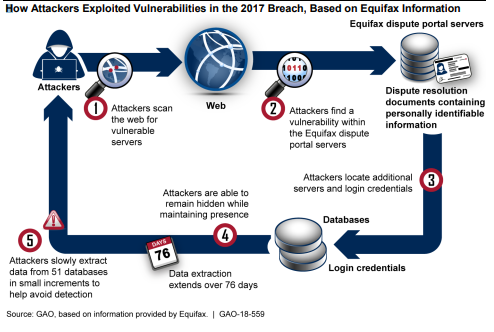

# Week Fifteen: TLS and Network Security

## Lab: Deep Dive: Equifax 2017 Data Breach

In 2017 hackers were able to infiltrate credit company Equifax and covertly export millions of records including PII. The Equifax hack is an impressive case study that encompasses multiple basic cybersecurity principles that can be understood by anyone with a minimal level of technical knowledge. In a report after the hack Equifax reported that the key failures involved in the hack were **"identification, detection, segmentation and data governance"**. The hack was not a single root cause, rather a combination of failures that resulted in catastrophic failure.

In March of 2017 the Apache Foundation, maker of Apache Struts, a web development resource implemented in many websites, found that there was a critical venerability in the resource. Apache recognized that users could use data entry fields, simple text entry boxes on websites, to produce an error. This error would temporary allow attackers to submit malicious code in the text felid while the application processed the error. The the submitted code would then be executed on the servers of the websites and allow hackers a way into the databases connected to the servers. Equifax was notified of this exploit and sent messages internally asking their database administrators to patch the software accordingly. This was te first failure. The distribution list notifying the administrators did not include one administrator of the Equifax dispute portal. This oversight and the administrators personal failure to learn about the exploit and find a patch caused it to stay open in the Equifax dispute portal. Two months later attackers would exploit this hole and find their way into the Equifax dispute portal database. Equifax failed to **identify** and patch the hole left in their door that lead to the initial breach.

Fortunately, even though the attackers were in, Equifax had a traffic inspection device within their network to look for suspicious transmissions. Unfortunately, the detector was not monitoring the data in the network. When any traffic goes in and out of a network a network administrator should be able to see all of it. In the equifax network transmissions were encrypted to ensure that attackers could not eavesdrop or modify transmissions. The program that monitored the data in the network had special permission to decrypt transmissions and inspect them for dubious data. To do this the traffic inspection device needed a TLS certificate, similar to badge proving its authority. To decrypt data the inspection device would present its certificate proving it had authorization to see the data and check for malicious content. This system ensures data is only decrypted in the case of proper authority. In the case of Equifax, the traffic inspection device's ceritficate was expired so it was unable to decrypt any traffic. This allowed the attackers to remain **undetected** as they accessed data and sent.

The attackers took full advantage of their invisibility within the network. Using their access in the dispute portal databse, the attackers gained access to root system commands which allowed them to explore other databases. At this point many other databases were properly cut off from the initial datable and protected by passwords. This would have been effective if the hackers had not discovered a database containing plaintext usernames and passwords for over 40 databases. Through the exploit into the dispute portal database, through encryption, and into another databse the attackers gained the keys to large swaths of the equifax data domain. This final failure in **segmentation** allowed hackers to spread throughout the network accessing more records.

Ironically, a software update, like the patch that was required initially, brought attention to the malfunction traffic inspection device. The network administrators identified the outdated certificate and upon updating it immediately saw malicious transmissions within the network. The attackers had gone completely unnoticed for 76 days within the network and made over 9000 queriers in total, far outside normal operation requirements. Millions of records had been transfered out of the network due to improper **data governance**.

Legally the hack had implications abroad and in the US. The FBI would later determine that the source of the hack was from the Chinese People’s Liberation Army. The Justice department would indite three Chinese nationals who were suspected in caring out the attack but they likely will not be prosecuted. A spokesperson for China's ministry of foreign affairs said China is a “staunch defender of cybersecurity” and they do not claim the attack. In the US the GAO did a full report of Equifax to analyze their failings. No new policy mitigates the factors that led to the attack but banking and federal organizations renegotiated their contracts to include cybersecurity.

The domino of successive errors that enabled this attack are dwarfed by the ethical implications of the fallout from the hack. As a consumer reporting agency or CRA Equifax, collects data on hundreds of people in order to see this information to a multitude of private and public institutions for insights into potential customers or employees. In many cases this data is not authorized to be collected by the people it pertains to and worse it includes PII like home address, Social Security Number, age, and nationality. With data that is so volatile and collected without explicit authorization of those it pertaions to there is an obvious need for careful handling of the data. Unfortunately it is clear the Equifax did not take the steps neccissary to not only prevent an inital intrusion into their databases but also oermitted the intrusion to expand and sustain itself. Since the hack Equifax has paid settlements to many who were effected and updated their data storage policies but these reactionary changes should have been initally implacted given the ethical duty bound to the volitility of the data they held.

#### Sources:

[GAO Equifax report](https://www.gao.gov/assets/gao-18-559.pdf)  
[WSJ indictment of Chinese hackers](https://www.wsj.com/articles/four-members-of-china-s-military-indicted-for-massive-equifax-breach-11581346824)  
[Explanation of out of date certificate](https://www.thesslstore.com/blog/the-equifax-data-breach-went-undetected-for-76-days-because-of-an-expired-certificate/)  
[Apache Struts venerability](https://nvd.nist.gov/vuln/detail/cve-2017-5638)  
[Video explaining the Apache Struts entrance](https://www.youtube.com/watch?v=_6Qbslgpw8U)  
[How you too can hack a website with this venerability](https://www.youtube.com/watch?v=MKaNxE7pGWA)  