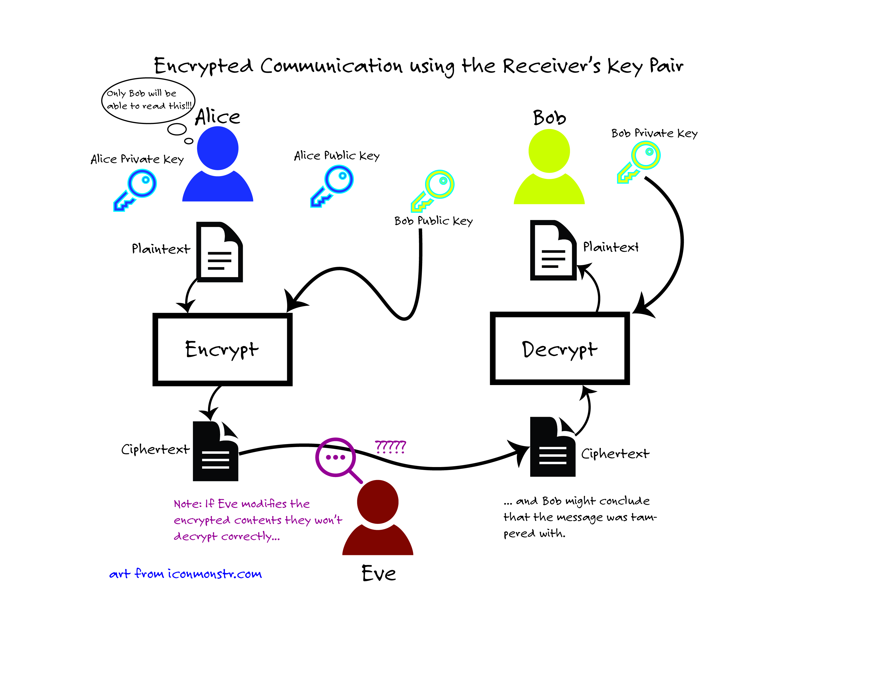
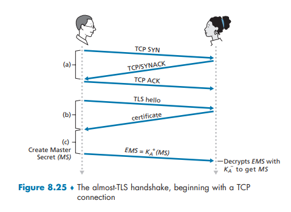

# Week Fifteen: TLS and Network Security

## Learning Goals

### I can explain how two strangers are able to exchange secret keys in a public medium

There are two main concerns when passing messages through a public medium:

1. Eavesdropping: sniffing and recording data passed accross a channel between two parties
2. Modification, insertion, or delition of messages or message content.

The issue of sharing information in a public medium or one that has the potential for these two threats has actuall existed for a very long time. As a result the science of cryptography has been used to encrypt messages to prevent eavesdropping. In the past 30 years the cryptography the internet uses has improved dramatically. Cryptography allows a user to take a plaintext message, use an encryption algorithm and produce cyphertext, and send it to a receiver who can decode the message. Unfortunatly, if the encryption algorithm is predictable, an intruder can reverse engineer the algorithm.

To prevent intruders from simply reverse engineering the encryption algorithms users use a secret key, a string of letters and numbers, with their plaintext message as inputs to an encryption algorithm to produce a message that requires another secret key to decrypt. In this situation both the sender and receiver need a secret, private, key they both know. This system is called symmetric encryption and it is better than just an encryption algorithm alone but not perfect for a public medium as both the sender and reciever need to know the secret key somehow.

For years the science of cryptography struggled with the issue of symmetric encryption and as the internet grew there was less opportunity for farther flung parites to ensure they both had a shared key. This problem was solved with the advent of public key encryption. Just under half a decade ago Mathematicians Diffie and Hellman created the system of public key cryptography where all parties have a private key, but more importantly a second, public key. In this system a sender encrypts a message with a public key belonging to the person who they want to send to. The message is now unredable to everyone (including the sender!) except for the receiver who holds a private key that can decrypt the message. In the message below this is demonstrated as Alice "locks the message" with bobs private key so it is unredable to the evesdropper, eve, and then bob can "unlock" it using his private key.

[img source](https://courses.cyber.usna.edu/SY110/calendar.php?type=class&event=22)

This solves the problem of eavesdropping well but unfortunately it creates a new problem. If a receiver assumes that all encrypted messages encrypted with their public key are safe it is possible someone is intercepting the messages, discarding the original ones regardless of their content, and inserting their own messages encrypted with the receivers public key. this problem of message integrity is defined by two things:

1. The message needs to be verified as originating from a trusted source
2. The message was not tampered in transmission.

This is done via digital signatures. Digital signatures are certifiable, nonforgeable tokens that verify where a message came from. This is done by first encrypting a message with a private sender signing key and then encrypting with a public receiver key. This makes it so that the message cannot be decrypted by anyone but the receiver. When the receiver decrypts the message they use a public verification key for the sender to ensure they privately signed it, ensuring the two points above. The get the public verification key from a verfication authority. Here insert a private key for the message and you're good to go.

[img source](https://courses.cyber.usna.edu/SY110/calendar.php?type=class&event=22)

### I can walk through the TLS handshake and explain why each step is necessary

A TLS session cannot begin without the TLS handshake. IT is necessary to both establish a secure TCP connection while also providing authentication between the host and the server. It also allows for the Encrypted Master Secret or shared secret key to be sent between host and server that can be used for the length of the TCP session.

**a:** Establish TCP connection
TLS is an enhancement of TCP known as Transport Level Security. At this level, TCP is required and therefore each must go through the normal TCP three way handshake from the transport layer to ensure a reliable connection is met.

1. TCP SYN
The host sends a TCP SYN to begin the TCP connection.

2. TCP/SYNACK
The server responds with their ACK to the SYN and sends a SYN to complete their end of the handshake.

3. TCP ACK
The host sends an ACK completing the handshake so a reliable connection is established.

**b:** Verify receivers identity
Here public keys are exchanged between the sender and the receiver that will lay the groundwork to ensure that the private keys can be passed without interception or modification.

1. TLS hello
The host requests the website's certificate to verify the website's identity. The server also lets the host know what version of TLS it is using so they are operating in the same way. They also send a random number known as a nonce. The host also lets the server know what type of encryption its using.

2. Certificate
The server chooses the TLS version to use, the encryption algorithm, and its own nonce to send back to the host. The server also sends a verified certificate with a public key in it to the host. This also includes a server key exchange message which will define how the exchange of private keys will occur.

**c:** Encrypted Master Secret

1. Pre-Master secret
The host encrypts a pre-master secret using the server's public key and sends it to the server

2. Calculate master secret
The host and server calculate the master secret independently this is used to create the HMAC keys for the host and server which are then applied to all handshake messages and sent between host and sever. This prevents tampering with the handshake and allows both the host and server to check for tampering.

[Helpful video that I used to understand TLS](https://www.youtube.com/watch?v=THxIyHz191A)
[Helpful video that I used to understand TLS Handshake](https://www.youtube.com/watch?v=86cQJ0MMses)

### I can explain how TLS prevents man-in-the-middle attacks

TLS encrypts important fields in TCP to prevent man-in-the-middle attacks. Within the TLS record there is a type, version, length and then the data and HMAC. The data and HMAC in a TLS session are specifically encrypted.

The host and server can see what part of the TLS session a packet is based on the type. Using this information they can decrypt the necessary information accordingly. TLS uses records appended to MAC to ensure integrity as records are sent between the two parties. This alone is not enough to protect from man in the middle attacks to sequence numbers are deployed to ensure that the entire message cannot be spoofed. This prevents a man-in-the middle attack because if the data is modified the seqence numbers will be off and segments are deleted or replaced on their journey between host and server.
