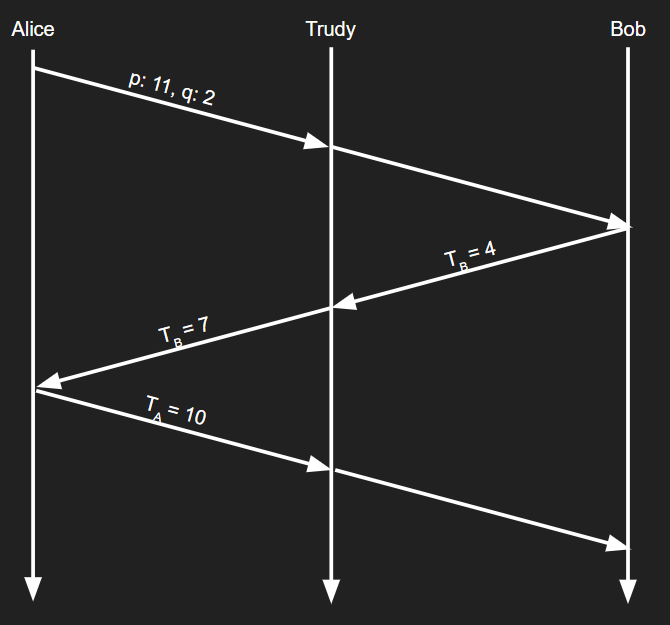

# Week Fifteen: TLS and Network Security

## Review Questions

### R20: In the TLS record, there is a field for TLS sequence numbers. True or false?

False, the sequence number is hashed with the HMAC key with the hash of the data.

### R21: What is the purpose of the random nonces in the TLS handshake?

Random nonces are neccisary to guarantee the integrity of session keys. Their randomness prevents replay attacks as thy are different every time and attackers cannot send fake sequences.

### R22: Suppose an TLS session employs a block cipher with CBC. True or false: The server sends to the client the IV in the clear

True, the IV, Initialization Vector is sent in cleartext because this step is before the data has been encrypted.

### R23: Suppose Bob initiates a TCP connection to Trudy who is pretending to be Alice. During the handshake, Trudy sends Bob Alice’s certificate. In what step of the TLS handshake algorithm will Bob discover that he is not communicating with Alice?

Bob realizes he is not communicating with Alice after he sends the Pre Master Secret. Trudy does not have Alice's private key even though she has her certificate so she will not be able to decrypt the PMS causing the handshake to not fully go through which will be idetified by the HMAC later on.

### P9: In this problem, we explore the Diffie-Hellman (DH) public-key encryption algorithm, which allows two entities to agree on a shared key. The DH algorithm makes use of a large prime number p and another large number g less than p. Both p and g are made public (so that an attacker would know them). In DH, Alice and Bob each independently choose secret keys, SA and SB, respectively. Alice then computes her public key, TA, by raising g to SA and then taking mod p. Bob similarly computes his own public key TB by raising to SB and then taking mod p. Alice and Bob then exchange their public keys over the Internet. Alice then calculates the shared secret key S by raising TB to SA and then taking mod p. Similarly, Bob calculates the shared key S′ by raising TA to SB and then taking mod p.

**a.** Prove that, in general, Alice and Bob obtain the same symmetric key, that is, prove $S = S'$

$$T_A = g^{S_A} \% p$$

$$T_B = g^{S_B}\% p$$

$$S   = T_B^{S_A}\% p$$

$$    = g^{S_A*S_B}\% p$$

$$S'  = T_A^{S_A}\% p$$

$$    = g^{S_A*S_B}\% p = S$$

**b.** With $p = 11$ and $g = 2$, suppose Alice and Bob choose private keys $SA = 5$ and $SB = 12$, respectively. Calculate Alice’s and Bob’s public keys, $TA$ and $TB$. Show all work.
$$T_A = g^{S_A}\% p = 10$$
$$T_B = g^{S_B}\% p = 4$$

**c.** Following up on part (b), now calculate S as the shared symmetric key. Show all work
$$S = T_B^{S_A}\% p = 1$$

**d.** Provide a timing diagram that shows how Diffie-Hellman can be attacked by a man-in-the-middle. The timing diagram should have three vertical lines, one for Alice, one for Bob, and one for the attacker Trudy.

### P14: The OSPF routing protocol uses a MAC rather than digital signatures to provide message integrity. Why do you think a MAC was chosen over digital signatures?

Every device is born with a MAC that no other interface can have the same number for and they are embeddded in hardward so they cannot be changed easily digitally.

### P23: Consider the example in Figure 8.28. Suppose Trudy is a women-in-the-middle, who can insert datagrams into the stream of datagrams going from R1 and R2. As part of a replay attack, Trudy sends a duplicate copy on one of the datagrams sent from R1 to R2. Will R2 decrypt the duplicate datagram and forward it into the branch-office network? If not, describe in detail how R2 detects the duplicate datagram.

R2 will not decrypt the duplicate datagram. The replay attack will not work because the sequence numbers will be off. R2 will try to verify the numbers being sent and realize that they match previous datagrams. In both routers the packets won't make it to the branch office because the sequence numbers are not correct.